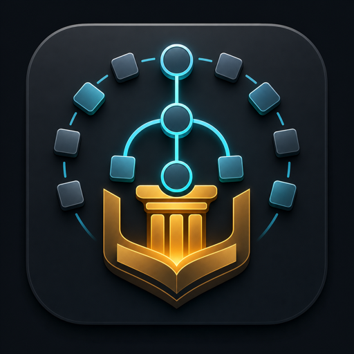

# Unified Skills

<p align="center">
  
</p>

> Unified Skills 是一套面向 AI Agent 的**工作制度架构**：用 [CANON.md](CANON.md) 定义共同宪法，用 Command 切分阶段，用 Agent 承担角色责任，用 Skill 注入可复用方法论。

它不是某一个技能的说明书，而是一个跨 Claude Code 与 Codex CLI 的整体架构：**宪法 + 命令阶段协议 + 角色责任边界 + 技能方法论 + Hooks 护栏 + 文档产物链**共同组成一套可验证、可扩展、可迁移的多产物开发系统。

## 安装与接入

### Claude Code Plugin

```bash
claude plugin add https://github.com/ZeroZ-lab/unified-skills
```

重启 session 后，使用 `/refine → /design → /plan → /build → /review → /ship` 进入主工作流。

### 本地开发挂载

```bash
git clone https://github.com/ZeroZ-lab/unified-skills.git
cd unified-skills
mkdir -p ~/.claude/skills ~/.claude/commands
ln -s "$(pwd)/skills/"* ~/.claude/skills/
ln -s "$(pwd)/commands/"* ~/.claude/commands/
```

### Codex CLI

Codex 侧不使用 repo 内 `$command` 薄包装。进入这个 repo 后，Codex 从 [AGENTS.md](AGENTS.md) 开始读取项目约束，并通过 [`.codex-plugin/plugin.json`](.codex-plugin/plugin.json) 暴露真实 `skills/` 目录。

```bash
git clone https://github.com/ZeroZ-lab/unified-skills.git
cd unified-skills
mkdir -p ~/.codex
codex plugin marketplace add https://github.com/ZeroZ-lab/unified-skills.git
```

启用 repo-local hooks 时，确保 `~/.codex/config.toml` 中包含以下配置。不要用覆盖式重写命令替换已有配置；如果文件里已经有其他 Codex 设置，请合并这一段。

```toml
[features]
hooks = true
```

这只启用 Codex hooks；也可以用 `codex --enable hooks` 做一次性启用。

如果当前机器已经安装过旧版本 Unified，升级仓库版本后还要同步宿主 marketplace 与 cache：

```bash
codex plugin marketplace upgrade unified-skills
CHECK_CODEX_CACHE=1 ./validate
```

注意区分两层状态：

- [`.codex-plugin/plugin.json`](.codex-plugin/plugin.json) 存在，表示仓库具备 Codex 插件入口
- `CHECK_CODEX_CACHE=1 ./validate` 通过，表示当前机器上的 Codex cache 已经和仓库版本同步

默认 direct mode 不会自动进入 Unified runtime。只有当你显式输入 `/brainstorm` `/refine` `/design` `/plan` `/build` `/review` `/ship` `/save` `/restore` `/learn` `/help`，或明确说“使用 Unified 工作流”时，才会激活 `skills-router.json`、loading tier 和阶段技能。

## 架构总览

```text
                 ┌──────────────────────────────────────┐
                 │ CANON.md                              │
                 │ 10 条不可变行为宪法；所有层都必须继承 │
                 └──────────────────┬───────────────────┘
                                    │
┌───────────────────────────────────▼───────────────────────────────────┐
│ 入口层 Entry                                                           │
│ - Claude Code: commands/ + CLAUDE.md 指针                              │
│ - Codex CLI: AGENTS.md + skills/ 真实技能目录                           │
└───────────────────────────────────┬───────────────────────────────────┘
                                    │
┌───────────────────────────────────▼───────────────────────────────────┐
│ Command 层：阶段协议 / Workflow Controller                              │
│ /refine /design /plan /build /review /ship /save /restore /learn │
│ /brainstorm /help                                                       │
└───────────────────────────────────┬───────────────────────────────────┘
                                    │
┌───────────────────────────────────▼───────────────────────────────────┐
│ Agent 层：专业责任边界 / Role Protocol                                  │
│ 角色负责需求、计划、工程、审查、侦察、发布等不同视角                   │
└───────────────────────────────────┬───────────────────────────────────┘
                                    │
┌───────────────────────────────────▼───────────────────────────────────┐
│ Skill 层：能力注入 / Capability Protocol                                │
│ SKILL.md 提供入口/出口、何时不使用、流程、红旗、常见说辞和验证清单      │
└───────────────────────────────────┬───────────────────────────────────┘
                                    │
┌───────────────────────────────────▼───────────────────────────────────┐
│ Artifact 层：可追踪产物链                                               │
│ docs/features/*、docs/bugs/*、ADR、review、ship、README 聚合             │
└───────────────────────────────────────────────────────────────────────┘
```

核心原则：**Command 负责阶段切分，Agent 负责角色分工，Skill 负责能力注入，CANON 负责全局纪律。**

## 目录

- [安装与接入](#安装与接入)
- [架构总览](#架构总览)
- [四层职责](#四层职责)
- [工作流状态机](#工作流状态机)
- [产物类型路由](#产物类型路由)
- [平台适配架构](#平台适配架构)
- [安全护栏](#安全护栏)
- [仓库结构](#仓库结构)
- [自动化工具](#自动化工具)
- [扩展与贡献](#扩展与贡献)

## 四层职责

### 1. CANON：全局宪法层

[CANON.md](CANON.md) 是最高优先级的行为合同。它不描述某个具体技能怎么做，而是规定所有 Agent 在所有阶段都必须遵守的纪律，例如：先陈述假设、范围收敛、验证优先、调试先找根因、不做 yes-machine、每个 feature 留痕。

```text
CANON.md
  ├─ 约束 Command：阶段不能跳过必要门控
  ├─ 约束 Agent：角色不能越权自证通过
  ├─ 约束 Skill：技能只能增加纪律，不能放松宪法
  └─ 约束 Artifact：产物必须留下可审计证据
```

### 2. Command：阶段协议层

`commands/` 下的命令是 Claude Code 的斜杠入口，也是整体流程的阶段协议。Command 不应该复制技能内容，而是声明：当前阶段读什么、调用谁、产出什么、何时通过。

| 命令 | 架构角色 | 主要产物 |
|------|----------|----------|
| `/brainstorm` | 发散与方案比较入口 | `00-brainstorm.md` |
| `/refine` | 需求收敛与事实扫描入口 | `01-spec.md` |
| `/design` | 证据驱动的创作设计门 | `02-design.md` |
| `/plan` | 任务拓扑与执行计划门 | `03-plan.md`、`plans/*.md` |
| `/build` | 增量实现与决策记录入口 | 软件 / 内容产物、ADR |
| `/review` | 多角色质量审查门 | `04-review.md` |
| `/ship` | 发布、导出与文档同步门 | `05-ship.md` |
| `/save` / `/restore` | 上下文持久化入口 | checkpoint |
| `/learn` | 跨 session 学习入口 | learnings 记录 |
| `/help` | 能力发现入口 | 命令概览 |

### 3. Agent：角色责任层

`agents/` 定义角色责任。Agent 的价值不是“多一个提示词”，而是建立责任边界：需求、计划、实现、审查、发布、侦察不能全部由同一个视角自证完成。

```text
Agent 负责：
  - 从一个专业视角判断问题
  - 明确自己负责什么、不负责什么
  - 调用对应 Skill 形成输出
  - 用 Blocking / Important / Suggestion 等分级表达风险

Agent 不负责：
  - 定义整个工作流状态机（这是 Command 的职责）
  - 修改 CANON 纪律（CANON 是上层合同）
  - 把方法论复制到自己内部（方法论应在 Skill）
```

### 4. Skill：能力注入层

`skills/` 是真实能力目录。每个技能以 `<phase>-<role>-<skill>/SKILL.md` 命名，提供可操作流程、入口/出口条件、何时不使用、常见说辞表、红旗清单和验证清单。强纪律技能还包含 Iron Law。长模板、长示例或评分表可以放在同目录辅助 `.md` 文件中，但必须由主 `SKILL.md` 引用并纳入 `skills-lock.json`。

| 阶段 | 架构职责 |
|------|----------|
| define | 把模糊想法变成可验证规格 |
| design | 用外部证据和本地事实定交互、视觉、排版、剧本、导演方案 |
| build | 计划、增量实现、TDD、上下文、源文档、工程模式和内容构建 |
| verify | 规格符合性、代码质量、调试、安全、性能、内容、视觉、Skill 质量和审查反馈 |
| ship | 发布、CI/CD、部署、导出、金丝雀、落地和文档同步 |
| maintain | 可观测性、迁移、上下文、学习、目标和使用引导 |
| reflect | 回顾与知识沉淀 |

## 工作流状态机

Unified 的主路径是一条带回路的状态机，而不是线性清单：

```text
/brainstorm（可选）
        │
        ▼
/refine ── 产出 01-spec.md，声明 artifact_type
        │
        ▼
/design ── 产出 02-design.md；纯后端或无创作设计时可按规则跳过
        │
        ▼
/plan ──── 产出 03-plan.md；大型/并行任务产出 plans/*.md
        │
        ▼
/build ─── 增量实现；需要决策时写 ADR；失败时进入 debug 回路
        │
        ▼
/review ── blocking 回 /build；批准后进入发布
        │
        ▼
/ship ──── 发布 / 导出 / canary / land / doc-sync
```

关键门控：

- `/refine` 使用 External Scan，把信息分层为 Fact / Pattern / Inference / Unknown / Adopt / Reject。
- `/design` 使用 Design Best-Practice Scan + 可选 Codex 视觉生成（mockup 图片 → design token）；`02-design.md` 必须写明 Design References、Pattern Synthesis、Adopt / Reject 和 Evidence Quality。批准后自动同步跨 feature token 到项目根 `DESIGN.md`。
- `/plan` 负责任务拓扑；只有 `Parallel Execution Matrix` 证明 `parallel_safe` 时才允许并行。
- `/build` 消费已批准的 `03-plan.md`；大型任务还会读取 `plans/*.md`。
- `/review` 负责阻断质量问题；blocking 不能靠口头承诺跳过。
- `/ship` 负责发布 / 导出审计、回滚或恢复路径、文档同步。

### 项目级设计约束

| 文档 | 位置 | 用途 |
|------|------|------|
| `DESIGN.md` | 项目根目录 | 跨 feature 的设计系统（Google Stitch token 格式），`/design` 批准后自动同步 |
| `02-design.md` | `docs/features/YYYYMMDD-<name>/` | 当前 feature 的创作设计定稿 |
| `design-inspiration-catalog.md` | `references/` | 优秀公司设计索引，Phase 2 扫描参考 |
| `design-pattern-extract.md` | `references/` | 高频设计模式提炼，Adopt / Reject 基线 |

## 产物类型路由

`artifact_type` 是 Unified 的多产物路由字段，写在 spec 中，默认值为 `software`。

| artifact_type | 路由含义 | 典型加载方向 |
|---------------|----------|--------------|
| `software` | 软件、服务、脚本、库 | TDD、API、数据库、UI、浏览器测试、代码审查、CI/CD、部署 |
| `document` | 说明文档、方案、规范 | 内容结构、事实核查、文档审查、导出和 doc-sync |
| `article` | 长文、叙事性内容 | 内容写作、逻辑链、风格一致性、内容审查 |
| `deck` | 演示文稿、汇报材料 | 信息层级、版式、节奏、导出审计 |
| `visual` | 视觉稿、海报、版式产物 | 视觉方向、构图、可访问性、视觉审查 |

这让同一套阶段协议能够服务不同产物：Command 不需要为每种产物复制一套流程，Skill 和 Agent 根据 `artifact_type` 选择具体方法论。

## 平台适配架构

Unified 在两个宿主中的入口不同，但共享同一套核心合同：

| 层 | Claude Code | Codex CLI |
|----|-------------|-----------|
| 项目约束入口 | `CLAUDE.md` 指向 `AGENTS.md` | `AGENTS.md` |
| 阶段入口 | `commands/` 中的斜杠命令 | 显式工作流命令或明确要求 Unified 时，按 `AGENTS.md` 激活 runtime |
| 能力来源 | `skills/` | `skills/` |
| 角色来源 | `agents/` | `agents/` |
| Hooks 配置 | `hooks/` / plugin 配置 | [`.codex/hooks.json`](.codex/hooks.json) + [`.codex/config.toml`](.codex/config.toml) |

Codex 不再维护 repo 内 `$command` 薄包装入口；这是一项架构收口：**真实技能只保留一份，入口文档只保留一个项目约束源。**

## 安全护栏

Hooks 是架构的运行时安全层，用于把纪律从“文档建议”变成“执行前检查”。

| Hook | Claude Code | Codex CLI | 架构目的 |
|------|-------------|-----------|----------|
| SessionStart | 自动注入宪法 + 可用性提示 | 自动注入宪法 + 可用性提示（需 `hooks = true` 或 `--enable hooks`） | 启动时提示 Unified 可用，但不默认接管 |
| careful | 提示确认（`ask`） | 默认直接阻止不可逆命令；限定在生成目录内的清理命令可放行 | 拦截破坏性命令，同时保留常见清理动作 |
| freeze | 直接阻止（`deny`） | 直接阻止（`deny`） | 阻止编辑冻结范围外文件 |

Codex 的 careful 仍然对不可逆操作使用 `deny`，因为确认型交互在 Codex 里不够稳定；但对显式限定在 `dist`、`coverage`、`node_modules` 等生成目录内的清理命令，会按条件放行，避免把日常维护也一并锁死。

### Hooks 配置差异

**Claude Code vs Codex CLI：**

| 差异项 | Claude Code | Codex CLI | 原因 |
|--------|-------------|-----------|------|
| SessionStart matcher | `startup\|clear\|compact` | `startup\|resume\|clear` | 平台支持的事件类型不同 |
| freeze 匹配工具 | `Edit\|Write` | `apply_patch` | Codex 使用 `apply_patch`（覆盖 Edit/Write） |
| 配置文件 | `hooks/hooks.json` | `.codex/hooks.json` | 平台特定的配置格式 |

这些差异**是有意的设计**，反映了两个平台的不同特性。功能上等价，但配置语法和实现方式不同。

## 仓库结构

```text
unified/
├── CANON.md                 全局宪法；所有技能的最高纪律
├── AGENTS.md                统一项目约束入口
├── CLAUDE.md                Claude 侧指针文件；不复制完整合同
├── README.md                整体架构介绍
│
├── commands/                Command 阶段协议层
├── agents/                  Agent 责任边界层
├── skills/                  Skill 能力注入层
├── hooks/                   SessionStart / careful / freeze 护栏
│
├── templates/               feature / bug 产物模板
├── references/              编排模式与设计最佳实践来源合同
├── docs/                    架构、历史、feature 与 bug 档案
├── skills-index.json        默认技能发现索引
└── skills-lock.json         技能完整性锁文件（SHA-256）
```

关键合同文件：
[AGENTS.md](AGENTS.md) 是统一项目约束入口；
[CLAUDE.md](CLAUDE.md) 只保留 Claude 侧指针；
[.codex-plugin/plugin.json](.codex-plugin/plugin.json) 指向真实 `skills/`；
[skills-index.json](skills-index.json) 是默认技能发现索引；
[skills-lock.json](skills-lock.json) 锁定每个 `SKILL.md` 以及技能同目录辅助 `.md` 文件的 SHA-256。

### 文档产物链

```text
docs/features/YYYYMMDD-<name>/
├── 00-brainstorm.md        ← /brainstorm
├── 01-spec.md              ← /refine
├── 02-design.md            ← /design
├── 03-plan.md              ← /plan
├── plans/*.md              ← /plan（大型 / 并行子计划）
├── adr/<num>.md            ← /build（架构或产品决策）
├── 04-review.md            ← /review
├── 05-ship.md              ← /ship
├── 06-canary-report.md     ← ship-workflow-canary
├── 07-deploy-report.md     ← ship-workflow-land
└── README.md               ← /ship 后聚合

docs/bugs/<name>/
├── 01-root-cause.md        ← verify-workflow-debug Phase 1–3
└── 02-fix-plan.md          ← verify-workflow-debug Phase 4
```

## 自动化工具

Unified 提供以下自动化工具减少手动同步负担：

### 版本同步

发版时使用版本同步脚本自动更新所有版本号：

```bash
# 1. 更新 package.json 版本号
vim package.json  # 修改为新版本号

# 2. 运行同步脚本
bash scripts/sync-version.sh

# 3. 验证同步成功
./validate
```

**预览模式:**

```bash
# 预览将要修改的文件（不实际写入）
bash scripts/sync-version.sh --dry-run
```

### 索引生成

修改技能（新增、重命名、删除）后重新生成索引：

```bash
# 生成 skills-index.json
bash scripts/generate-index.sh

# 验证生成成功
./validate
```

**预览模式:**

```bash
# 显示将要生成的索引（不实际写入）
bash scripts/generate-index.sh --dry-run
```

### 测试

所有自动化脚本都有对应的测试：

```bash
# 测试版本同步
bash scripts/tests/test-sync-version.sh

# 测试索引生成
bash scripts/tests/test-generate-index.sh
```

### 验证脚本

运行完整验证确保项目健康：

```bash
./validate
```

如果这次改动涉及 Codex 插件发布面、版本 bump，或你要确认本机已安装的 Unified 没有 stale cache，再追加一次严格宿主校验：

```bash
CHECK_CODEX_CACHE=1 ./validate
```

验证脚本会自动检查：
- 版本号一致性
- 索引与技能目录一致性
- 自动化脚本存在性
- 其他项目健康检查

## 扩展与贡献

扩展 Unified 时，要把修改放在正确架构层：

| 你要改变什么 | 应该改哪里 | 不应该改哪里 |
|--------------|------------|--------------|
| 全局行为纪律 | [CANON.md](CANON.md) | 单个 `SKILL.md` 偷偷放松纪律 |
| 阶段顺序或产物门控 | `commands/`、[AGENTS.md](AGENTS.md) | Agent 内部私自改状态机 |
| 专业角色责任 | `agents/` | Skill 里混入角色身份 |
| 可复用执行方法 | `skills/<phase>-<role>-<skill>/SKILL.md` | Command 里复制大段方法论 |
| 产物格式 | `templates/`、`docs/` | README 里维护第二套格式 |
| 技能发现 / 哈希 | [skills-index.json](skills-index.json)、[skills-lock.json](skills-lock.json) | 只改文件不更新索引和锁 |

提交前必须运行：

```bash
./validate
```

新增或修改技能时还必须遵守：

- 新技能命名为 `<phase>-<role>-<skill>/SKILL.md`。
- 新技能必须有入口/出口条件、何时不使用、可操作流程、常见说辞表、红旗清单、验证清单。
- 技能辅助 `.md` 文件必须由主 `SKILL.md` 明确引用，并同步写入 `skills-lock.json` 的 `auxiliaryHashes`。
- 强纪律技能必须额外包含 Iron Law。
- 技能只能增加 `CANON.md` 的纪律，不能减少或绕开。
- 不引入第三方依赖；Unified 保持零依赖。

## License

MIT
