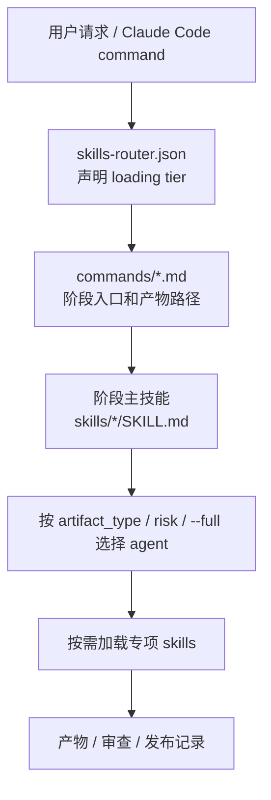
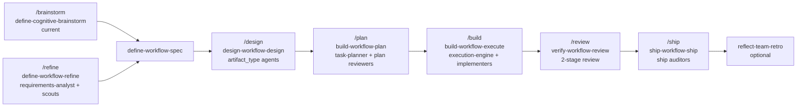
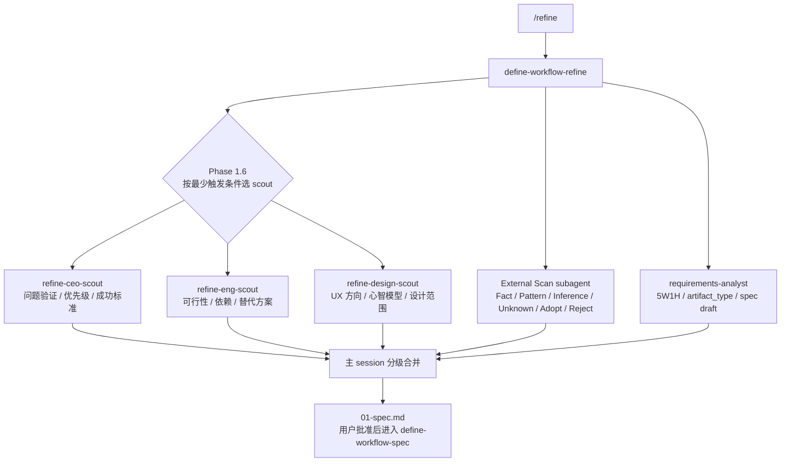
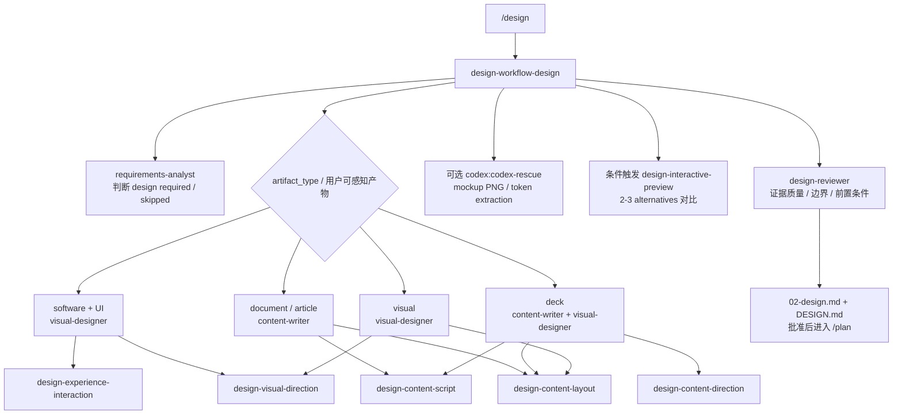
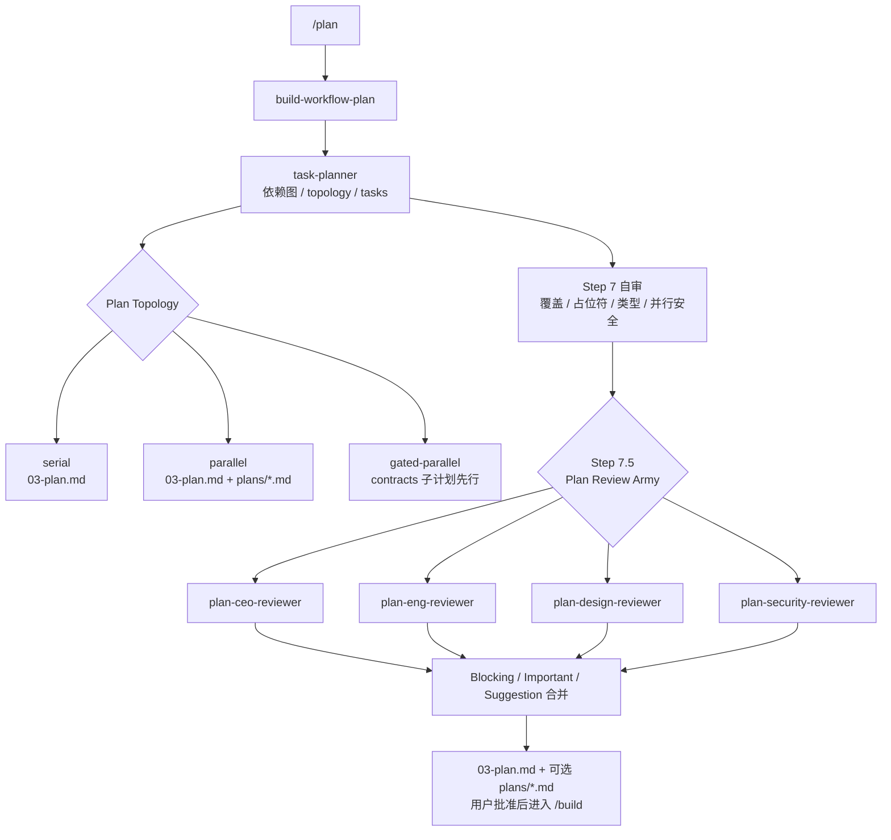
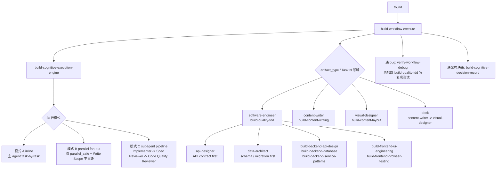
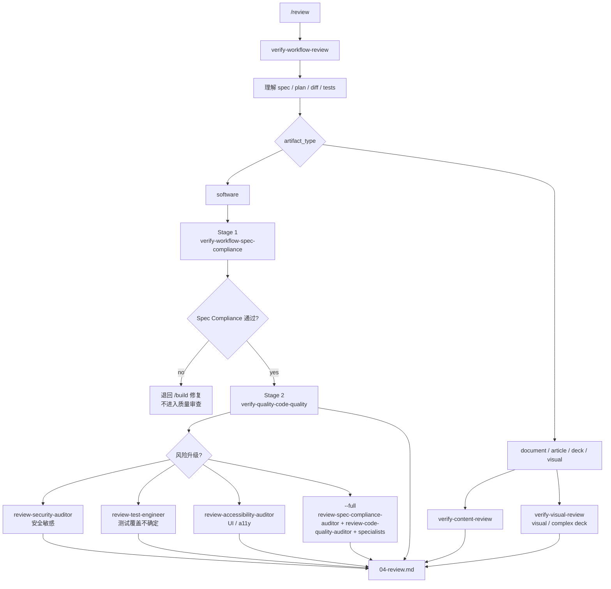
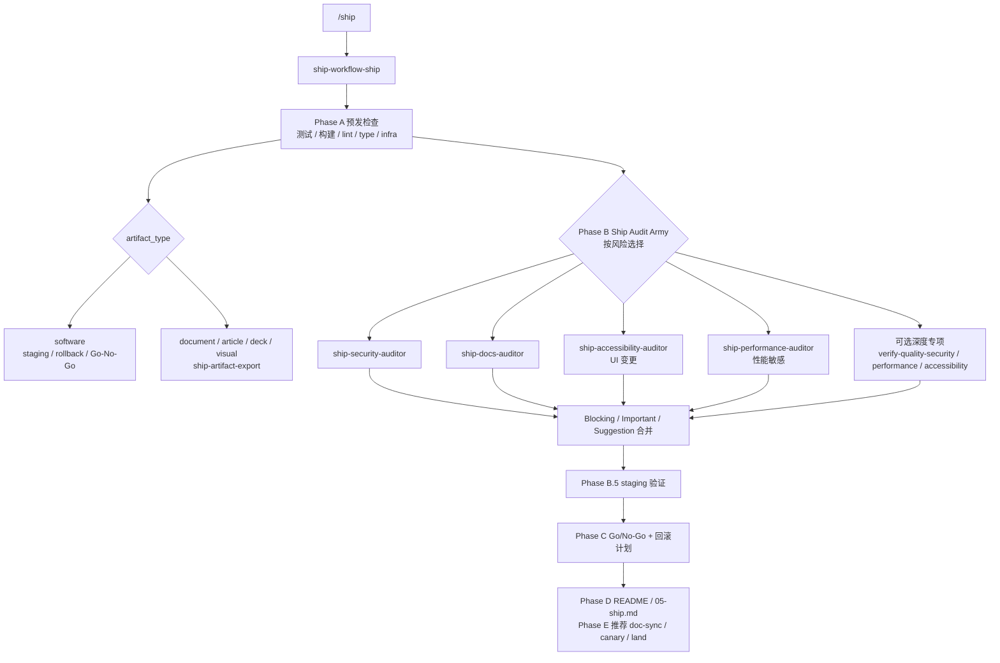
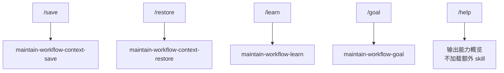

# Current Command-Agent-Skill Call Graph

> 当前实现视图。本文只描述仓库当前合同，不替代 `AGENTS.md`、`skills-router.json` 和阶段 `SKILL.md`。如果本文和真实技能冲突，以真实技能为准。

## 读取顺序

每次任务入口的加载顺序是：

关键边界：

- `commands/` 是阶段入口，负责说明流程位置、产物路径和命令级门控。
- `skills/*/SKILL.md` 是调用权威，真正决定 agent 何时出现、哪些专项 skill 必须加载。
- `agents/` 只定义 persona 和职责边界，不单独创建路由规则。
- 未被风险规则选中的 agent 不需要占位输出。

## 总览矩阵

| Command | 阶段主 skill | 默认 agent | 风险/条件 agent | 下游专项 skills |
|---------|--------------|------------|-----------------|----------------|
| `/brainstorm` | `define-cognitive-brainstorm` | current agent | 无专属 persona | 无；清晰后建议进入 `define-workflow-spec` |
| `/refine` | `define-workflow-refine` | `requirements-analyst` | External Scan subagent；`refine-ceo-scout`、`refine-eng-scout`、`refine-design-scout` | 完成后指向 `define-workflow-spec` |
| `/design` | `design-workflow-design` | 按 `artifact_type` 选择 | `requirements-analyst`、`content-writer`、`visual-designer`、`design-reviewer`、可选 `codex:codex-rescue` | `design-experience-interaction`、`design-visual-direction`、`design-content-script`、`design-content-direction`、`design-content-layout`、`design-interactive-preview` |
| `/plan` | `build-workflow-plan` | `task-planner` | `plan-ceo-reviewer`、`plan-eng-reviewer`、`plan-design-reviewer`、`plan-security-reviewer` | `verify-workflow-review` 用于 plan review 模式 |
| `/build` | `build-workflow-execute` | `task-planner` 做模式选择；按产物选择 implementer | `software-engineer`、`api-designer`、`data-architect`、`content-writer`、`visual-designer`；复杂任务可进入 execution-engine subagent pipeline | `build-cognitive-execution-engine`、`build-quality-tdd`、`build-backend-*`、`build-frontend-*`、`build-content-*`、`build-cognitive-decision-record`、遇 bug 加 `verify-workflow-debug` |
| `/review` | `verify-workflow-review` | current agent | `review-spec-compliance-auditor`、`review-code-quality-auditor`、`review-security-auditor`、`review-test-engineer`、`review-accessibility-auditor` | `verify-workflow-spec-compliance`、`verify-quality-code-quality`、`verify-content-review`、`verify-visual-review` |
| `/ship` | `ship-workflow-ship` | current agent | `ship-security-auditor`、`ship-performance-auditor`、`ship-accessibility-auditor`、`ship-docs-auditor` | `ship-artifact-export`、`ship-infrastructure-ci-cd`、`ship-workflow-doc-sync`、推荐闭环 `ship-workflow-canary` / `ship-workflow-land` |
| `/save` | `maintain-workflow-context-save` | current agent | 无 | 无 |
| `/restore` | `maintain-workflow-context-restore` | current agent | 无 | 无 |
| `/learn` | `maintain-workflow-learn` | current agent | 无 | 其他技能在关键节点可调用它记录学习 |
| `/goal` | `maintain-workflow-goal` | current agent | 无 | 无 |
| `/help` | 无额外 skill | current agent | 无 | 无 |

## 主工作流

## `/refine` 展开

触发规则：

- 小型变更可跳过 Scout Army。
- 标准功能至少 CEO + Eng 双视角。
- 大型功能、UI 或合规需求三视角全开。

## `/design` 展开

硬门：

- required design 缺 Sources / Patterns / Adopt / Reject 时不得批准。
- `02-design.md` 不写实现步骤或 task breakdown。
- 纯后端、脚本、迁移、CI 配置可以明确记录 skipped。

## `/plan` 展开

触发规则：

- 小型变更可跳过 Plan Review Army。
- 标准变更至少 CEO + Eng。
- 大型、安全、合规、`--full`、对抗性审核或全身体检才全开。

## `/build` 展开

硬门：

- `/build` 只消费已批准 plan，不重新创建正式任务列表。
- 每个 `### Task N` 是最小执行单元，当前任务验证未过不得进入下一个。
- 并行必须来自 `Parallel Execution Matrix` 的显式 `parallel_safe` 证据。
- subagent 的 `changed_files` 必须落在对应 `Write Scope` 内。

## `/review` 展开

硬门：

- software 必须先 Spec Compliance，再 Code Quality。
- 功能不完整时不得进入质量审查。
- 非 software 按产物类型进入内容/视觉审查。

## `/ship` 展开

触发规则：

- 小型变更可跳过 Audit Army。
- 标准变更至少 security + docs。
- UI 变更加 accessibility。
- 性能敏感变更加 performance。
- `--full` 四个 auditor 全开。

## 维护命令

`maintain-workflow-learn` 也可被其他技能在关键节点调用，用于记录跨 session 学习。

## 风险升级规则

| 信号 | 常见追加 |
|------|----------|
| UI / 视觉 / deck | `visual-designer`、`design-*`、`verify-frontend-accessibility`、`review-accessibility-auditor`、`ship-accessibility-auditor` |
| 安全 / auth / user input / sensitive data | `verify-quality-security`、`review-security-auditor`、`ship-security-auditor` |
| 性能敏感 / 查询 / bundle / 热路径 | `verify-quality-performance`、`ship-performance-auditor` |
| 数据库 / migration / storage | `data-architect`、`build-backend-database`、安全审查 |
| public API / endpoint contract | `api-designer`、`build-backend-api-design`、安全审查 |
| 文档 / article / deck | `content-writer`、`build-content-writing`、`build-content-layout`、`verify-content-review`、`ship-artifact-export` |
| `--full` / 对抗性审核 / 全身体检 / 高风险发版 | 当前阶段相关 reviewer / auditor 全开 |

## 已知非调用关系

- `/brainstorm` 不调用专属 `agents/*.md` persona。
- `agents/` 不自发路由；阶段技能没有选中时，agent 不运行。
- `/review` 不是所有 reviewer 默认全开；默认 current agent 先做两阶段审查。
- `/build` 不是看到可并行就并行；必须由 `Parallel Execution Matrix` 证明。
- `/design` 的 `codex:codex-rescue` 是可选视觉增强，不替代 design persona、证据扫描或 design-reviewer。
- `commands/help.md` 只输出能力概览，不加载额外 skill。

## 维护检查

当修改调用关系时，同步检查：

- `commands/*.md` 是否仍镜像阶段技能。
- `skills/*/SKILL.md` 的 Agent Dispatch Contract 是否是权威来源。
- `agents/README.md` 是否只描述 persona 和调用时机，不新增独立规则。
- `skills-router.json` 是否仍覆盖入口触发和 loading tier。
- `AGENTS.md` 是否仍保持 AGENTS 单入口模型。
- 运行 `./validate`，但不要把绿色结果等同于语义完全一致；仍需人工审查以上合同面。
